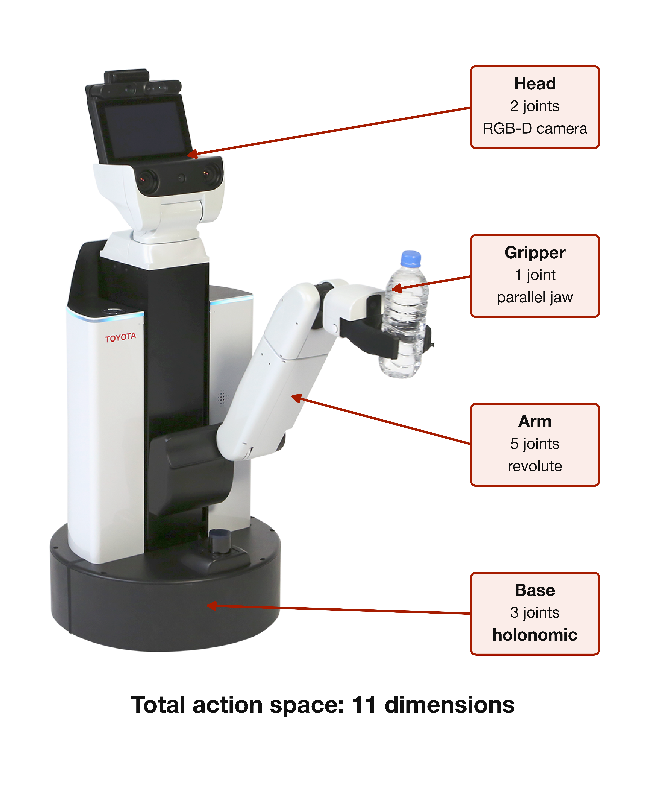
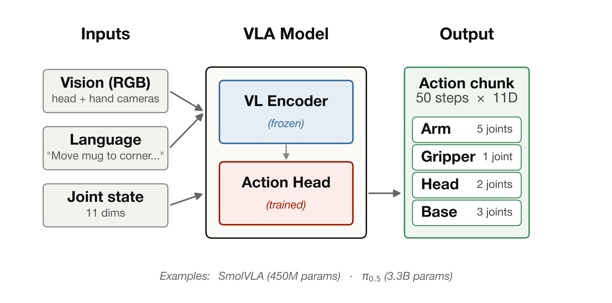
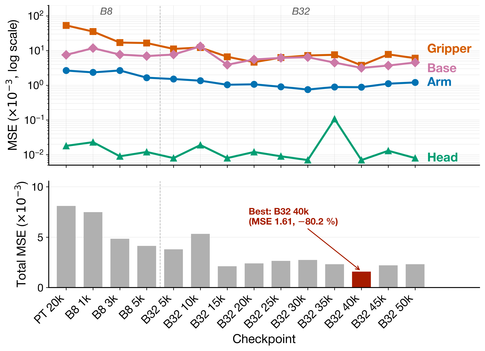
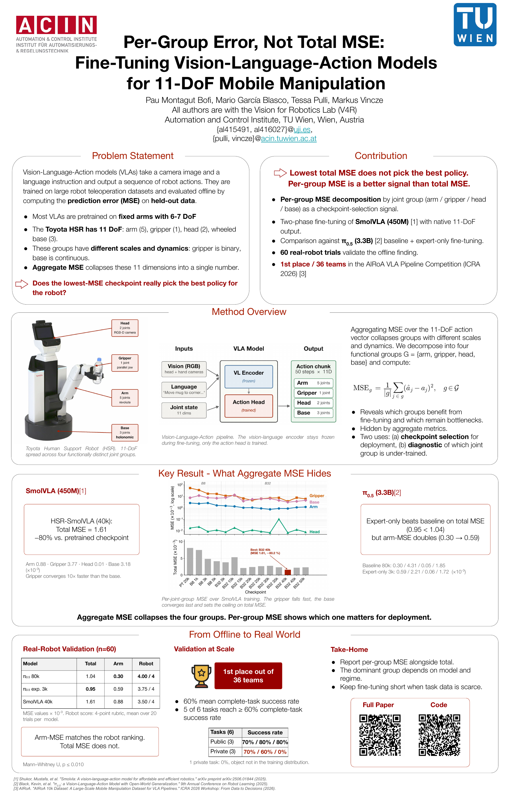

# Per-Group MSE for Vision-Language-Action Models on the Toyota HSR


[](https://arxiv.org/abs/2606.00253)
[](https://huggingface.co/PauMontagut/per-group-mse-smolvla)
[](https://paumontagut.github.io/per-group-mse-vla/)

> **Under construction.** This repository is being cleaned up after the ICRA 2026
> workshop. If you found it from the poster QR or the paper, the most useful files
> right now are `paper/extended_abstract.pdf` and `eval/per_group_mse.py`. The
> training scripts run as-is on the original setup but expect local dataset paths.
> See `docs/CONTEXT.md` for the few things that are not obvious from the code.

This repository accompanies the paper *Per-Group Error, Not Total MSE:
Fine-Tuning Vision-Language-Action Models for 11-DoF Mobile Manipulation*
(ICRA 2026 Workshop "From Data to Decisions", 1st place out of 36 teams).

<p align="center">
  
</p>

## In one paragraph

The Toyota HSR has 11 degrees of freedom split across four functionally different
joint groups, namely a 5-DoF arm, a 1-DoF parallel gripper, a 2-DoF head, and a
3-DoF holonomic base. The standard offline metric for VLA fine-tuning is a single
MSE over the full action vector. We found that this number can pick the wrong
checkpoint, since the one with the lowest total MSE was not the one that deployed
best on the real robot.

Decomposing MSE into the four groups recovers the signal. In our 60-trial robot
evaluation the arm-MSE ranking matched the robot ranking, while total MSE did not.

<p align="center">
  
  <br>
  <sub><i>The vision-language encoder stays frozen during fine-tuning. Only the action head is trained.</i></sub>
</p>

## Results at a glance

| Model | Total MSE (×10⁻³) | Arm MSE (×10⁻³) | Robot score (mean of 20 trials) |
|---|---|---|---|
| π₀.₅ baseline (80k) | 1.04 | **0.30** | **4.00 / 4** |
| π₀.₅ (ours) | **0.95** | 0.59 | 3.75 / 4 |
| HSR-SmolVLA (40k) | 1.61 | 0.88 | 3.50 / 4 |

Mann–Whitney U (one-sided), p ≤ 0.010 between the π₀.₅ baseline and
either fine-tuned model. The lowest total MSE (our π₀.₅ submission) is
not the best policy on the robot. The arm-MSE column matches the robot
ranking. Raw scores for all 60 trials are in
[`data/robot_trials.csv`](data/robot_trials.csv) and the statistics can
be regenerated with `python figures/robot_trials.py`.

<p align="center">
  
  <br>
  <sub><i>Per-joint-group MSE across the SmolVLA training schedule. The gripper falls fast, the base converges last and sets the ceiling on total MSE. The bottom panel shows total MSE with the best checkpoint (B32 40k) highlighted. Checkpoint naming, PT is the generalist checkpoint after pretraining, B8 and B32 are fine-tuning runs with batch size 8 and 32, and the number that follows counts training steps.</i></sub>
</p>

<p align="center">
  <a href="paper/poster.pdf"></a>
  <br>
  <sub><i>ICRA 2026 workshop poster. Click the image for the full PDF.</i></sub>
</p>

## Repository structure

```
per-group-mse-vla/
├── README.md                       this file
├── LICENSE                         MIT
├── CITATION.cff
├── paper/
│   ├── extended_abstract.pdf       the paper as published at the workshop
│   └── poster.pdf                  the ICRA 2026 poster
├── eval/
│   └── per_group_mse.py            loads a checkpoint, reports per-group MSE
├── training/
│   ├── train_smolvla_generalist.py phase 1, SmolVLA on AIRoA MoMa
│   ├── train_smolvla_task.py       phase 2, task-specific top-up
│   └── train_pi05_finetune.py   π₀.₅ fine-tuning launcher (openpi)
├── inference/
│   ├── policy_server.py            WebSocket server, loads SmolVLA, returns (T, 11)
│   ├── smoke_test.py               synthetic client, run before touching a robot
│   ├── Dockerfile                  CUDA 12 + Python 3.12 + LeRobot v0.5.1
│   └── README.md
├── data/
│   ├── robot_trials.csv            raw 60-trial rubric scores from the paper
│   └── README.md                   schema and protocol notes
├── figures/
│   ├── mse_curves.py               reproduces the per-group MSE figure
│   └── robot_trials.py             reproduces the robot-trial stats and figure
├── scripts/
│   ├── dataset_info.py             summarise a LeRobot v3.0 dataset
│   └── find_corrupt_episodes.py    flag episodes with broken video frames
└── docs/
    ├── BACKGROUND.md               concepts behind the paper, glossary
    ├── SETUP.md                    installing the two environments
    ├── REPRODUCE.md                end-to-end reproduction of the results
    ├── INFERENCE.md                I/O contract and real-robot deployment
    ├── CONTEXT.md                  decisions, dropped paths, workarounds
    └── img/
        ├── pipeline.png            VLA pipeline figure
        ├── hsr_annotated.png       HSR with the four joint groups annotated
        ├── mse_curves.png          per-joint-group MSE figure
        ├── inference_topology.png  client and server topology
        ├── poster_thumbnail.png    poster used in the README
        └── src/                    TikZ source for the figures above
```

If you have never worked with a VLA before, read
[`docs/BACKGROUND.md`](docs/BACKGROUND.md) first. The rest of the docs
assume you know what a VLA is, what fine-tuning means and what an action
chunk is. Quick links into the docs.

- [`docs/BACKGROUND.md`](docs/BACKGROUND.md) explains the concepts behind the paper for readers new to VLAs. Glossary at the end.
- [`docs/SETUP.md`](docs/SETUP.md) walks through installing the two environments.
- [`docs/REPRODUCE.md`](docs/REPRODUCE.md) is the step-by-step from pretraining to the figure, and points at the canonical config sources.
- [`docs/INFERENCE.md`](docs/INFERENCE.md) describes how the checkpoint runs on the robot, the WebSocket contract, and the failure modes we hit.
- [`docs/CONTEXT.md`](docs/CONTEXT.md) collects the choices that are not obvious from the code (hardware budget, dropped paths, workarounds).

## Quick start

The pipeline has two halves that live in different ecosystems.

- **SmolVLA** (HuggingFace, PyTorch) is trained and evaluated with the
  [LeRobot](https://github.com/huggingface/lerobot) framework. The scripts in
  `training/train_smolvla_*.py` are thin wrappers around `lerobot-train`.
- **π₀.₅** (OpenPI, JAX/orbax) is trained with the
  [openpi](https://github.com/Physical-Intelligence/openpi) repo. The script in
  `training/train_pi05_finetune.py` is a launcher that points at an openpi
  config. See the script header for the exact config name.

Once the LeRobot environment is installed (see `docs/SETUP.md`), evaluate a
checkpoint with

```bash
python eval/per_group_mse.py \
    --checkpoint path/to/checkpoint/pretrained_model \
    --dataset-root path/to/task6911-v30 \
    --n-samples 240
```

## Hardware and dataset context

A few choices in this repo come from the practical setup, not from a paper
recommendation, and are worth knowing before reading the scripts.

- **Single RTX 3090 (24 GB), within the lab's shared-hardware budget.** Batch
  sizes are 8 to 32 rather than the 64+ used in the original SmolVLA paper.
  Top-up runs use batch 8 with mixed precision so the job fits in ~4 GB.
- **The fine-tuning subset** is the private relocation subset of the
  AIRoA ICRA 2026 dataset, distributed only to the competing teams.
  The full ICRA 2026 dataset was not realistic to train on a 3090. The
  generalist pretraining uses the public AIRoA MoMa set.
- **Video backend `pyav`** instead of `torchcodec` for large datasets,
  because `torchcodec` leaks file descriptors on long training runs.
- **Episode 3997 is corrupt** in some snapshots of AIRoA MoMa and is excluded
  from all splits (see `scripts/find_corrupt_episodes.py`).
- **SmolVLA expects three cameras**, the HSR has two. The `--policy.empty_cameras=1`
  flag fills the missing slot.

More detail (including paths we tried and dropped, like LoRA on the π₀.₅
80k baseline) is in `docs/CONTEXT.md`.

## Reproducing the paper results

`docs/REPRODUCE.md` walks through the full chain, from pretraining and top-up
to evaluation and figure. The checkpoints themselves are not redistributed
here. SmolVLA top-up checkpoints can be regenerated from the public AIRoA MoMa
set, and the π₀.₅ baseline checkpoint is the one released by the AIRoA workshop.

## Datasets

- **AIRoA MoMa** (generalist pretraining). Public mobile-manipulation dataset,
  accessed through the AIRoA channels.
- **AIRoA ICRA 2026** (full competition set). Released alongside the ICRA 2026
  workshop "From Data to Decisions". `task6911` is the relocation subset used
  here for fine-tuning.

This repository does not redistribute either dataset.

## The ICRA 2026 workshop

The paper was developed for the **AIRoA VLA Pipeline Competition**, the
flagship track of the *From Data to Decisions in Vision-Language-Action
Models* workshop at ICRA 2026. The workshop's stated goal is to bridge
the gap between large-scale teleoperation datasets and policies that
actually work on heterogeneous robots, and the competition concretises
that goal by running every submitted policy on the same Toyota HSR
under the same evaluation harness. Across five rounds and 36
participating teams, we finished **1st**. Workshop information,
official baselines, evaluation rounds and the list of accepted papers
are at the workshop website,
[icra2026vlapipeline.github.io](https://icra2026vlapipeline.github.io/).

The best SmolVLA checkpoint from the paper (HSR-SmolVLA, batch 32,
40k steps, the one highlighted in the per-group MSE figure) is
published on the Hugging Face Hub at
[**PauMontagut/per-group-mse-smolvla**](https://huggingface.co/PauMontagut/per-group-mse-smolvla).

```python
from huggingface_hub import snapshot_download
from lerobot.policies.smolvla.modeling_smolvla import SmolVLAPolicy

ckpt_dir = snapshot_download("PauMontagut/per-group-mse-smolvla")
policy = SmolVLAPolicy.from_pretrained(ckpt_dir).eval().cuda()
```

The release was sanitised before upload with `scripts/prepare_hf_release.py`
(lab-local paths in `train_config.json` rewritten to placeholders). The
model weights, the normalisation statistics and the preprocessor blobs
were not modified.

### A note on the π₀.₅ checkpoint

The π₀.₅ checkpoint we submitted to the competition is **not
redistributed** here. It is a fine-tune of the `baseline_80k` released
by the AIRoA workshop only to the competing teams, which means our
derivative inherits the same confidentiality scope under the AIRoA NDA.
The fine-tuning code (`training/train_pi05_finetune.py`), the offline
results, the 60-trial robot scores and the ablation against LoRA are
all in the repository, and the only piece that stays behind the NDA
is the binary weights file. If AIRoA releases `baseline_80k` publicly
in the future, our derivative becomes publishable and the checkpoint
will appear here at that point.

## Paper

The extended abstract published at the ICRA 2026 workshop is in
[`paper/extended_abstract.pdf`](paper/extended_abstract.pdf), and the
poster is at [`paper/poster.pdf`](paper/poster.pdf). The arXiv
preprint is at
[arxiv.org/abs/2606.00253](https://arxiv.org/abs/2606.00253).

## Limitations

Worth flagging before someone takes the result further than it goes.

- **Sample size on the robot is small.** 60 trials, 20 per model, two
  objects. The paper's claim is that arm-MSE ranks better than total
  MSE on this set, not that the magnitudes generalise to a different
  set of tasks or a different robot.
- **The rubric is operator-assigned.** We did not have an external
  rater. The 4-point scale is ordinal and the test we use
  (Mann-Whitney U) is robust to that, but a different operator could
  draw the 3 versus 4 line slightly differently.
- **One robot, one lab, one calibration.** Lighting, table height,
  object pose and operator behaviour were kept as close to the
  fine-tuning distribution as we could manage. We have not stressed
  the policy on a substantially different scene.
- **Per-group MSE is not a substitute for online evaluation.** It is
  a much better predictor of online ranking than total MSE, but the
  gap between offline and on-robot will always exist for VLAs of this
  size. Treat per-group MSE as the right offline summary, not as a
  free lunch.
- **The competition pipeline is closed-source on the evaluator side.**
  The submission code and the evaluator are upstream and not
  redistributed here. What we ship is a server skeleton that speaks
  the same shape of contract, not the workshop's exact harness.

## Future work

The per-group decomposition is currently a diagnostic and a
checkpoint-selection signal. The same analysis can be brought into the
training loop itself, for example by weighting the joint groups in the
action loss so the optimizer spends its capacity where the robot needs
it most, or by scheduling that weighting as the groups converge at
different rates. We are actively investigating this direction and it
will be the subject of upcoming work.

## Acknowledgements

This work was carried out at the Vision for Robotics Lab (V4R),
Automation and Control Institute, TU Wien. It is the result of a
collaboration between Pau Montagut Bofi, Mario García Blasco,
Dr. Tessa Pulli and Prof. Markus Vincze. The V4R lab provided
access to the Toyota HSR and the GPU infrastructure used for
training and offline evaluation.

The AIRoA project provided the AIRoA MoMa and AIRoA ICRA 2026
datasets, the π₀.₅ baseline checkpoint, and the evaluation harness
used for the competition. The HuggingFace LeRobot and Physical
Intelligence openpi teams maintain the open-source frameworks that
made this work feasible on a single 24 GB GPU.

## Citation

```bibtex
@inproceedings{montagut2026pergroup,
  title  = {Per-Group Error, Not Total {MSE}: Fine-Tuning Vision-Language-Action
            Models for 11-{DoF} Mobile Manipulation},
  author = {Montagut Bofi, Pau and Garc\'ia Blasco, Mario and
            Pulli, Tessa and Vincze, Markus},
  booktitle = {ICRA 2026 Workshop on From Data to Decisions},
  year   = {2026},
  eprint = {2606.00253},
  archivePrefix = {arXiv},
  primaryClass  = {cs.RO},
  url    = {https://arxiv.org/abs/2606.00253}
}
```

If you also use the SmolVLA or π₀.₅ backbones, please cite the
original papers as well. References in `docs/BACKGROUND.md`.

## Further reading

If you want to dig deeper, the canonical entry points are listed below.

**Frameworks used in this repo**

- LeRobot, the framework behind the SmolVLA path
  ([repository](https://github.com/huggingface/lerobot),
  [documentation](https://huggingface.co/docs/lerobot)). The training
  config we forward to lives in
  [`src/lerobot/configs/train.py`](https://github.com/huggingface/lerobot/blob/main/src/lerobot/configs/train.py).
- openpi, the framework behind the π₀.₅ path
  ([repository](https://github.com/Physical-Intelligence/openpi)). The
  registry of training configs is
  [`src/openpi/training/config.py`](https://github.com/Physical-Intelligence/openpi/blob/main/src/openpi/training/config.py).

**Models we fine-tune**

- *SmolVLA, a vision-language-action model for affordable and efficient
  robotics*. Shukor *et al.*, [arXiv:2506.01844](https://arxiv.org/abs/2506.01844).
- *π₀.₅, a Vision-Language-Action Model with Open-World
  Generalization*. Black *et al.*,
  [arXiv:2504.16054](https://arxiv.org/abs/2504.16054).

For a wider view of the modern VLA recipe, the SmolVLA paper itself and
the [RT-2 paper](https://arxiv.org/abs/2307.15818) by Brohan *et al.*
are good entry points. They are referenced from `docs/BACKGROUND.md`.

**Workshop and dataset**

- *From Data to Decisions in Vision-Language-Action Models*, the ICRA
  2026 workshop this paper was submitted to.
- AIRoA, the project that released both AIRoA MoMa and the ICRA 2026
  dataset ([GitHub organisation](https://github.com/airoa-org)).

**Robot platform**

- The Toyota Human Support Robot (HSR) is the platform used throughout
  the paper. Its 11-DoF layout (5 arm, 1 gripper, 2 head, 3 holonomic
  base) is the reason per-group MSE is even an interesting question.

## License

MIT (see `LICENSE`). The paper PDF in `paper/` is under CC BY 4.0 (workshop
submission license).
