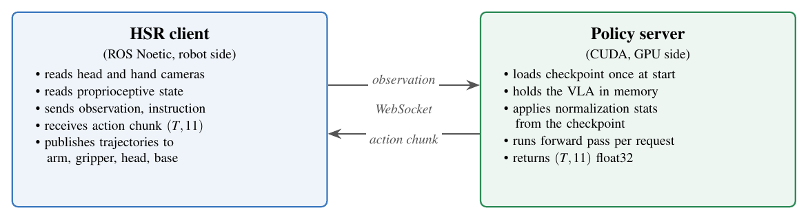

# Inference and real-robot deployment

This is a high-level description of how a fine-tuned checkpoint actually
runs on the Toyota HSR, including the I/O contract, the runtime topology
and the latency figures we measured. We deliberately do not include source
code from the workshop evaluator (it is the property of the AIRoA workshop
and not redistributed here), but everything below is enough to put your
own policy server behind the same kind of contract.

## I/O contract

The policy is queried as a request and response over a WebSocket. Each
request carries one fresh observation, each response carries one short
chunk of future actions. The robot client decides when to ask for the
next chunk.

**Observation (request)**

| Key              | Shape           | dtype | Notes                                            |
|------------------|-----------------|-------|--------------------------------------------------|
| `head_rgb`       | (480, 640, 3)   | uint8 | RGB from the head camera                         |
| `hand_rgb`       | (480, 640, 3)   | uint8 | RGB from the in-hand camera                      |
| `state`          | (8,)            | f32   | Proprioceptive state (5 arm + 1 gripper + 2 head) |
| `instruction`    | str             |       | Natural-language prompt for the current task     |

The state vector is in unnormalized robot units (radians for joints, an
open/closed scalar for the gripper). Normalization is applied inside the
policy server using the statistics shipped with the checkpoint.

**Action chunk (response)**

| Key       | Shape   | dtype | Notes                                  |
|-----------|---------|-------|----------------------------------------|
| `actions` | (T, 11) | f32   | T future actions in the 11-DoF layout  |

The 11 columns are, in order

```
arm_lift, arm_flex, arm_roll, wrist_flex, wrist_roll,    # arm  (5)
gripper,                                                  # grip (1)
head_pan, head_tilt,                                      # head (2)
base_x, base_y, base_theta                                # base (3)
```

T is the policy's action horizon (50 in our setup). The client ingests the
chunk, executes a prefix on the robot, and asks for the next chunk before
the prefix runs out.

## Runtime topology

There are two processes, usually running on two machines.

<p align="center">
  
</p>

The client uses ROS Noetic to read from the robot's topics (cameras,
proprioception) and to publish trajectory commands to the arm, gripper,
head and base controllers. The server is a Python process that loads the
checkpoint once at startup and answers WebSocket requests in a loop.

Both processes are containerised. The two halves talk over a port on
`localhost` if you put them on the same host, or over the LAN if the
robot's onboard PC is too modest to run the VLA. We ran the server on a
24 GB GPU machine and the client on the robot's onboard PC.

The TikZ source for this figure lives in `docs/img/src/inference_topology.tex`,
in case you want to re-render it with different labels or aspect ratio.

## Bringing up the server

The exact orchestration script lives with the workshop evaluator and is
not redistributed here. We do include a small **server skeleton** in
[`inference/`](../inference/) (a self-contained `policy_server.py` plus
a smoke test and a Dockerfile) that demonstrates the contract end to
end. It is a fresh implementation, not a copy of the workshop code, so
it is safe to read and adapt.

The shape of the steps is generic enough that you can rebuild it for
your own deployment. You build a server container on a CUDA-12 base
image with the inference dependencies (torch, transformers, safetensors
and tokenizers for SmolVLA, or the OpenPI runtime for π₀.₅), and at
build time you pre-download the SmolVLM processor so the container can
later boot without internet. You mount the checkpoint as a volume and
point at it with an environment variable (we used
`POLICY_CHECKPOINT_PATH`). You start the server on a known port (8000
in our case) and you exercise it from the host with a synthetic smoke
test before plugging in any robot. The smoke test catches checkpoint
shape mismatch, missing or wrong norm stats, and version skew across
the host and the container, all of which are silent failures on the
robot but loud failures here.

## Bringing up the client and the robot

The client side runs inside ROS Noetic. First you bring up the robot's
onboard stack (camera nodes, controllers, navigation, TTS) and verify
that the head and hand cameras are publishing on the topics the client
expects. The HSR's hand camera is not always launched by the default
bring-up and may need to be started by hand, pointing `usb_cam_node` at
`/dev/hand_camera`.

Once the cameras are alive, position the robot before launching
anything. Tilting the head down (`head_tilt_joint` around `-0.7` rad)
puts a table at a comfortable distance, and resetting the arm to a
known home pose avoids a big jerk on the first chunk (see the bumper
note below).

After that you launch the client telling it where the policy server
lives (host and port) and what instruction to use for this episode,
and you switch the client into "auto" mode. The client only executes
actions while it sees `auto` on its `control_mode` topic, and the
simplest way to keep it running is to publish `auto` at a steady rate
(10 Hz is plenty).

The model has no stopping condition of its own. A trial ends when the
episode timer expires, when the operator hits the emergency stop, or
when an external rule (rubric, success detector) decides that the task
is done.

## Failure modes we ran into

These are the ones that took longest to diagnose during deployment,
kept here as a checklist for the next time.

- **No CUDA inside the container.** Docker's default runtime is `runc`,
  which does not expose the GPU. Add `--runtime=nvidia` (or set the
  `nvidia-container-runtime` daemon as default) and verify with
  `docker run --rm --runtime=nvidia --gpus all <cuda-image> nvidia-smi`.
  The [NVIDIA Container Toolkit guide](https://docs.nvidia.com/datacenter/cloud-native/container-toolkit/latest/install-guide.html)
  walks through the daemon setup.
- **`hand_camera` publishes nothing.** The robot's default bring-up does
  not always launch the hand camera node. Start it by hand with
  `usb_cam_node` against `/dev/hand_camera`. The
  [`usb_cam` ROS wiki page](https://wiki.ros.org/usb_cam) lists the
  node parameters.
- **The robot accepts requests but does not move.** Almost always
  because `control_mode` is `None`. Publish `auto` on that topic at a
  steady rate. The HSR's safety layer is described in the Toyota HSR
  user manual under "Control modes". The manual is shipped with the
  robot and is not in this repository.
- **Wrong instruction sent.** The launch file may default the
  instruction to a hard-coded string. Add an explicit
  `<arg name="instruction" .../>` and pass it on the command line. The
  [`roslaunch` XML reference](https://wiki.ros.org/roslaunch/XML/arg)
  covers the `<arg>` and `<param>` tags.
- **Robot looks at the ceiling.** Drive the head before the trial,
  `head_tilt_joint` to about `-0.7` rad puts a table in the centre of
  the frame.
- **Bumper trips on the first big action.** Press and release the
  emergency-stop button to clear the flag, and start the trial from a
  pose where the first predicted chunk does not need a sudden base
  acceleration. The robot's safety monitor vetoes commands whose
  implied accelerations exceed configured limits, which can happen
  silently the first time you run a fresh policy on a stationary
  robot. The same pattern shows up in most mobile-manipulator stacks.

## A note on what the policy actually does

It is easy to anthropomorphise the chunked control loop. The policy does
not "plan" the full task in one shot. Each call sees only the current
observation and emits its best guess for the next ~1 second of motion. If
the robot moves into a state the policy has never seen during fine-tuning,
the next chunk will be off and the trial will look like the policy
"gave up". Most of our R4 failure videos look exactly like that, the
robot drifts a few centimetres off the trained distribution and the
policy hands back chunks that are no longer useful.
